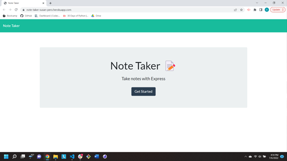

# NoteTaker

- As a small business owner, I want to be able to write and save notes so that I can organize my thoughts and keep track of tasks I need to complete.

## Description

- This calendar allows the user to input daily events. Events include dates, times, titles, and descriptions.

## Acceptance Criteria

- When I open the Note Taker, I am presented with a landing page with a link to a notes page, I am presented with a landing page with a link to a notes page.
- When I click on the link to the notes page, I am presented with a page with existing notes listed in the left-hand column, plus empty fields to enter a new note title and the note's text in the right-hand column.
- When I enter a new note title and the note's text, a Save icon appears in the navigation at the top of the page.
- When I click on the Save icon, the new note I hae entered is saved and appears in the left-hand column with the other existing notes.
- When I click on an existing note in the list in the left-hand column, that note appears in the right-hand column.
- When I click on the Write icon in the navigation at the top of the page, I am presented with empty fields to enter a new note title and the note's text in the right-hand column.

## Repository Link

- Repository can be found at:  
  [GitHub](https://github.com/susangrace909/NoteTaker.git)  
  [Live Site](https://note-taker-susan-pero.herokuapp.com/)

## Screenshot:

